# Void Cloak — Particleで構成するフード付き黒マントキャラクター（Unity URP）

参考画像のフード付き黒マントを、**数学的に定義した布面の上に大量のParticleをサンプリング**して再現するUnity用一式です。
ランダムに点を散らして形を作るのではなく、

```
シルエット → 3D断面 → 布面 → Major Fold → Secondary Fold → Edge → Micro Noise → Particle Sampling
```

の順で形状を作ります。

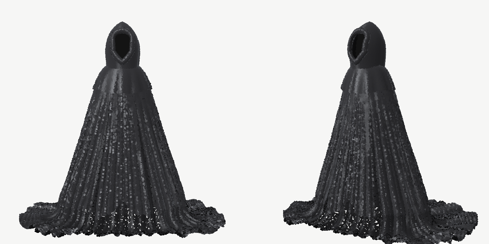

（上の画像はUnity外のオフラインプレビュー（`Tools/Preview`）で、シェーダーと同じライティング式を使ったもの。点サイズ0.02。）

---

## ファイル構成

| ファイル | 役割 |
|---|---|
| `Assets/VoidCloak/Scripts/VoidCloakCharacter.cs` | MonoBehaviour。Inspector、Mesh(`MeshTopology.Points`)生成、Material設定 |
| `Assets/VoidCloak/Scripts/VoidCloakGenerator.cs` | 各Particle群の生成関数（`GenerateHood()` 〜 `GenerateGroundWrinkles()`）とサーフェスサンプラー |
| `Assets/VoidCloak/Scripts/VoidCloakSurfaces.cs` | 布面の数式定義（フード殻・開口部・縁・Void・肩ケープ・ドレープ） |
| `Assets/VoidCloak/Scripts/VoidCloakMath.cs` | `FoldField`（シワの山と谷）、プロファイル曲線、乱数、ノイズ |
| `Assets/VoidCloak/Scripts/VoidCloakSword.cs` | 剣の設定（`VoidCloakSword`）と、刀身・鍔・グリップ・柄頭・袖の形状 |
| `Assets/VoidCloak/Scripts/VoidCloakGenerator.Sword.cs` | 剣と袖のParticle生成（持ち方ごとの配置） |
| `Assets/VoidCloak/Scripts/VoidCloakMover.cs` | WASDで歩く・走る、布の揺れをシェーダーに渡す |
| `Assets/VoidCloak/Scripts/VoidCloakFollowCamera.cs` | 後ろから追いかけるカメラ（右ドラッグで回転、ホイールでズーム） |
| `Assets/VoidCloak/Scripts/Echo/EchoSystem.cs` | 音の波の管理（シェーダーへ渡す、敵へ知らせる） |
| `Assets/VoidCloak/Scripts/Echo/EchoPlayer.cs` | 足音の波と鐘打ち |
| `Assets/VoidCloak/Scripts/Echo/EchoKit.cs` / `EchoKitPiece.cs` | 中世建築の部品キット（数式で作る建物と当たり判定） |
| `Assets/VoidCloak/Scripts/Echo/EchoKitTown.cs` | 町の部品（家・焼け落ちた家・井戸・市場の屋台） |
| `Assets/VoidCloak/Scripts/Echo/EchoPointBuilder.cs` | 石積み・敷石・円柱・屋根などの点の作り方 |
| `Assets/VoidCloak/Scripts/Echo/EchoShapes.cs` | 聴き手・抜け殻の鎧の体と、プロトタイプステージの配置 |
| `Assets/VoidCloak/Scripts/Echo/EchoEnemy.cs` | 敵の共通の決まり（剣が当たる・パリィされる） |
| `Assets/VoidCloak/Scripts/Echo/EchoListenerEnemy.cs` | 聴き手（音だけで追ってくる敵） |
| `Assets/VoidCloak/Scripts/Echo/EchoHollowArmorEnemy.cs` | 抜け殻の鎧（波を出さずに巡回する敵） |
| `Assets/VoidCloak/Scripts/Echo/EchoBellShrine.cs` | 鐘の祠（セーブ地点・回復・聴き手を追い払う） |
| `Assets/VoidCloak/Scripts/Echo/EchoStages.cs` | ステージの配置データ（序章・プロトタイプ）と残響の人影の形 |
| `Assets/VoidCloak/Scripts/Echo/EchoChapter1.cs` | 第一章「灰の城下町」の配置データ |
| `Assets/VoidCloak/Scripts/Echo/EchoStageEvents.cs` | 画面の文字（ヒント・セリフ・章タイトルの見た目） |
| `Assets/VoidCloak/Scripts/Echo/EchoHintZone.cs` | 入るとヒントやセリフが出る場所 |
| `Assets/VoidCloak/Scripts/Echo/EchoMemoryGhost.cs` | 残響（金色の人影と最後の言葉） |
| `Assets/VoidCloak/Scripts/Echo/EchoStageGoal.cs` | ステージのゴール（着いたら次の章へ） |
| `Assets/VoidCloak/Scripts/Echo/EchoGame.cs` | ゲーム全体（章の一覧・セーブ・一時停止・メニューの操作） |
| `Assets/VoidCloak/Scripts/Echo/EchoSceneFader.cs` | 暗転してシーンを切り替える |
| `Assets/VoidCloak/Scripts/Echo/EchoStageInfo.cs` | 各ステージの章番号（章タイトル表示・セーブ・つづきから） |
| `Assets/VoidCloak/Scripts/Echo/EchoPauseMenu.cs` | 一時停止メニュー（Esc / Start） |
| `Assets/VoidCloak/Scripts/Echo/EchoTitleScreen.cs` | タイトル画面 |
| `Assets/VoidCloak/Scripts/Echo/EchoPuzzleBell.cs` | 謎解きの鐘（剣で打つかFで鳴らす） |
| `Assets/VoidCloak/Scripts/Echo/EchoBellDoor.cs` | 歌う扉（鐘を同じ順に鳴らすと開く） |
| `Assets/VoidCloak/Scripts/Echo/EchoHollowWall.cs` | 空洞の壁（大きな音に響く、強攻撃で壊せる） |
| `Assets/VoidCloak/Scripts/Echo/EchoAudio.cs` | 3D音響で効果音を鳴らす（残響・環境音つき） |
| `Assets/VoidCloak/Scripts/Echo/EchoSoundSynth.cs` | 効果音をプログラムで作る |
| `Assets/VoidCloak/Shaders/EchoWorldPoint.shader` | 波が通った所だけ見える世界用シェーダー |
| `Assets/VoidCloak/Editor/EchoPrototypeSceneBuilder.cs` | メニューからプロトタイプのシーンを作る |
| `Assets/VoidCloak/Scripts/VoidCloakSettings.cs` | 形状パラメータ、Particle数、`CloakPart`、`BuildStage` |
| `Assets/VoidCloak/Shaders/VoidCloakPointShader.shader` | URP用シェーダー `VoidCloak/ClothPoint` |
| `Tools/Preview/` | Unity外で形状を確認するためのツール（Unityにはインポートしない） |

**役割分担:** 形状はC#、見た目・材質・描画・風はHLSL。

## セットアップ

1. `Assets/VoidCloak` フォルダをUnityプロジェクト（URP）の `Assets/` にコピー
2. 空のGameObjectを作成し `VoidCloakCharacter` を追加（MeshFilter / MeshRendererは自動で追加される）
3. Inspectorの **Character Shader** に `VoidCloakPointShader` をアサイン
   （またはこのシェーダーでMaterialを作って **Material Template** にアサイン）
   - `Shader.Find()` は何もアサインされていない時の最後のフォールバックとしてのみ使用
4. `[ExecuteAlways]` なので、Play前からScene Viewに表示される
5. 右クリックメニュー（コンテキストメニュー）の **Regenerate** で手動再生成も可能

## 段階的な制作（Build Stage）

Inspectorの **Build Stage** で、引き継ぎ資料の制作順どおりに確認できます。各段階はそれ以前の段階をすべて含みます。

| Stage | 内容 |
|---|---|
| Step01_HoodAndVoid | フード（Crown / Left / Right Shell）、開口部の縁、内部Void |
| Step02_Shoulders | 肩ケープ |
| Step03_OuterSilhouette | 外側マントの基本シルエット（シワなし） |
| Step04_MajorFolds | 大シワ ＋ シワの山と谷に沿った高密度Particle |
| Step05_FrontCloak | 中央前垂れ（CenterLeft / CenterRight）と内側の前布（FrontFold） |
| Step06_LowerDrape | 縦→斜め→地面へと流れが変わる下部 |
| Step07_GroundCloth | 地面に溜まる布（左右それぞれOuter/Middle/Inner）、地面の横シワ、裾の縁 |
| Step08_SecondaryFolds | 中シワ |
| Step09_MicroNoise | 最後に少量のMicro Noise |
| Complete | 全部 |

光沢（STEP 10）と風（STEP 11）はシェーダー側なので、常に有効です。

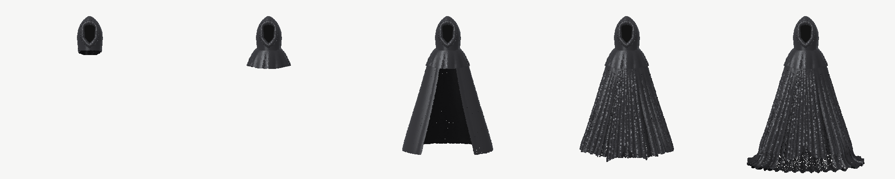

構造の確認には **Debug Part Colors** をONにすると、Particle群ごとに色分けされます。

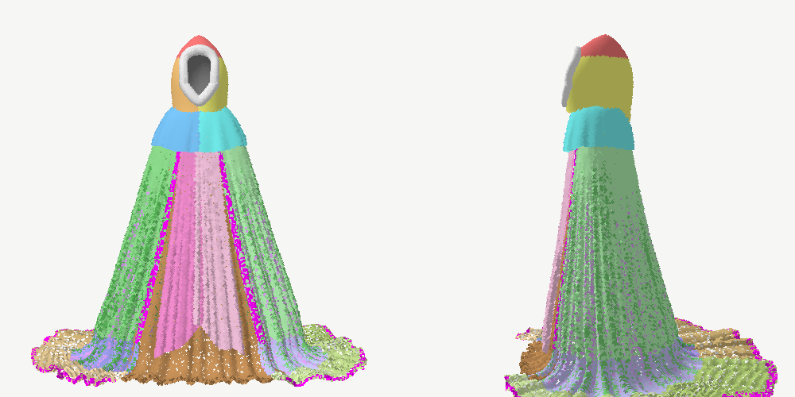

## 形状の作り方（要点）

- **座標**: 足元 Y=0、正面 +Z、+X がキャラクターの右。4.2 units基準で作り、`Height` で全体をスケール。
- **フード**: 高さごとの水平楕円を積み重ねた布の殻。上部は `(1 - Q^2.2)^(1/crownSoftness)` の柔らかい山型（球ではない）。顔の開口部（上が丸く、側面は縦、下が少し尖る）は殻の**穴**として抜いており、顔パーツや黒い板は存在しない。
- **開口部の縁 (OpeningRim)**: 開口部の輪郭に沿った、巻いた布端のチューブ。内側を向いた面はVoidへ暗くなる。
- **InnerVoid**: 開口部の奥にある凹んだカップ状の面。シェーダーでほぼ黒（わずかな濃淡のみ）。布の裏側（`N·V < 0`）も暗くなるので、フード内部は奥行きのある黒になる。
- **肩**: 首から外側へほぼ水平に張り、端で落ちるケープ。厚みは他より大きい。
- **マント (DrapeSurface)**: 高さごとの楕円断面（幅・前後の厚みとも下へ行くほど増える。背中側の方が深い）。縦部分 → 円弧で曲がる下部 → 地面に寝た部分、が**1枚の連続した面**なので、縦シワがそのまま斜め、地面の放射状シワへと流れる。
- **シワ (FoldField)**: シワ1本ずつが「山の線」`u = c_i(t)` を持ち、山と山の間が谷になる断面（`cos` 位相＋谷位置のゆがみ）。間隔の不均一さ、振幅、途中から始まるシワ、下へ行くほどの横流れ（外側へ）、下部での斜め流れをシワごとに持たせている。左右は別の乱数列で作るので鏡像にならない。深さは局所的なシワ間隔に比例するので、上は細く浅く、下は太く深くなる。
- **中央前垂れ**: 外側マントより前（+Z）に出た2枚のパネル。中央で少し重なり、下端は斜めで左右で形が違う。後ろに内側の前布（FrontFold）がある。
- **地面**: 布束（左右それぞれOuter/Middle/Inner）で裾の到達距離と高さを変え、横・斜めのシワ（GroundWrinkles）を足している。最外周にHemEdge。
- **サンプリング**: 布面を格子に分けて実面積×密度ウェイトでCDFを作り、層化してParticleを配置（塊や穴ができない）。法線と流れ方向は折り目を含む最終形状から差分で求めるので、シワの山にハイライトが乗る。各Particleは Front / Front-Middle / Back-Middle / Back の4層の薄い厚みの中に置く。

## 中世の剣（Sword）

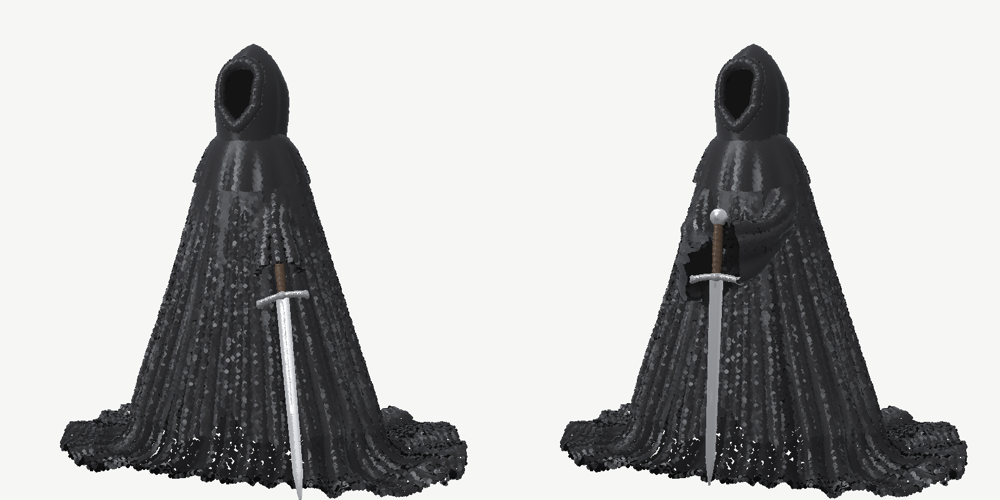

Inspectorの **Sword** で設定します（`enabled` で表示/非表示）。剣もマントと同じParticleで作り、シェーダーで鋼（steel）と革（leather）として描画します。

- **形**: ロングソード。刀身は菱形断面、先へ行くほど薄く細くなり、中央に溝（フラー）があり、先端は尖る。十字の鍔は両端が刃側へ少し曲がり、端が広がる。グリップは中央が少し太い革巻き（らせん状の巻き目）。柄頭は円盤形（ホイールポメル）。
- **持ち方（Pose）**: 腕や手は出さず、**手は布の袖（ベルスリーブ）の中**。袖の奥は黒く、手は見えません。
  - `LoweredRight`: 右手で剣を下げ、切っ先を前方の地面に置く
  - `PlantedFront`: 体の前で剣を地面に立て、両手で柄を握る
  - `Custom`: `Custom Tip`（切っ先の位置）と `Custom Blade Direction`（鍔から切っ先への向き）で自由に配置
- **見た目（Sword Look）**: Steel Color、Steel Reflection（下/上）、Reflection Strength、Specular、Gloss、Grip Color。反射は空と地面の色を擬似的に映すだけなので、Reflection Probeは不要です。
- 剣は風で揺れません。袖は少しだけ揺れます。
- マントは剣や腕を避けるように変形しないので、袖の付け根はマントの中に隠れる位置から出しています。

## WASDで歩く

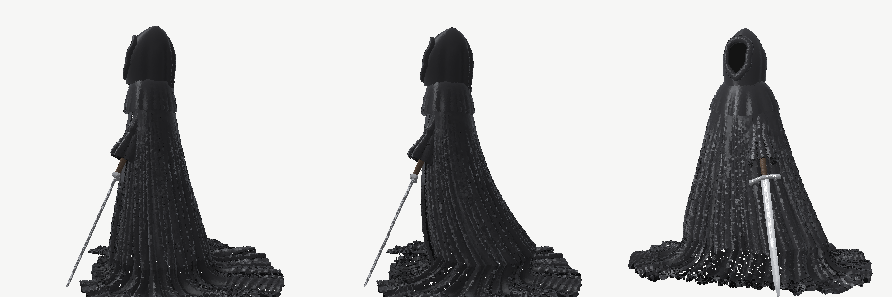

（左：静止、中・右：歩行中。裾と地面の布が後ろへ流れる）

1. キャラクターのGameObjectに **VoidCloakMover** を追加
2. Main Cameraに **VoidCloakFollowCamera** を追加し、**Target** にキャラクターのGameObjectをドラッグ
3. Playして操作する

| 操作 | 内容 |
|---|---|
| W / A / S / D（矢印キーも可） | カメラから見た前後左右へ歩く（キャラクターは進む方向を向く） |
| 左Shift | 走る |
| 右クリックしながらドラッグ | カメラを回す |
| マウスホイール | ズーム |

- 新しいInput Systemと古いInput Managerのどちらでも動きます（Project Settings → Player → Active Input Handling の設定に自動で合わせる）。
- 床との当たり判定が必要なら、同じGameObjectに **CharacterController** を追加します（重力つきで移動する。Height 4.2、Radius 0.8、Center Y 2.1 が目安）。追加しない場合は今の高さのまま滑るように移動し、床は不要です。
- カメラは自動では回りません（移動がカメラ基準なので、自動で回ると A/D/S でぐるぐる回ってしまうため）。向きを変えたいときは右ドラッグで回します。
- 歩くと、裾が後ろへ流れ、一歩ごとに前の布が左右交互に押し出され、体が少し上下します。フード・肩・剣は固定です。強さは VoidCloakMover の **Cloth Motion**（Trail Strength、Max Trail、Step Push、Bob Height など）で調整します。
- 走ると（Shift）、裾がさらに長く後ろへ流れて持ち上がり、肩から裾へ波が走り、裾が左右にはためきます。強さは **Run Max Trail**（走るときの流れる長さ）、**Run Billow**（はためき）、**Walk Billow**（歩くときの少しのはためき）で調整します。

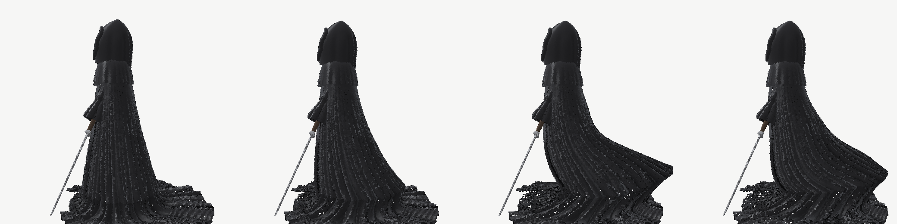

（左から：静止、歩行、走行の2コマ）

- 地面に広がっている布も一緒に動きます。歩く・走ると引きずられて後ろへ流れ、走ると後ろ側から地面を離れて波打ちます（地面より下には沈みません）。強さは **Floor Follow**（どれだけ一緒に動くか）、**Floor Lift**（走るときにどれだけ持ち上がるか）で調整します。

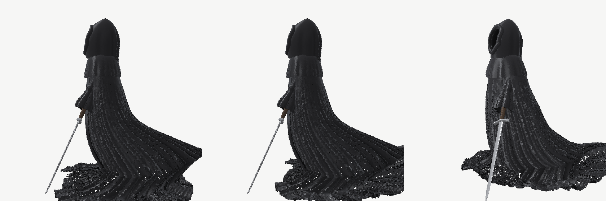

（左：地面の布が動かない以前の状態、中・右：地面の布も一緒になびく）

- 注意：`LoweredRight` の持ち方では、歩くと剣先が地面を滑ります。

## ゲームとして通して遊ぶ（タイトル画面から）

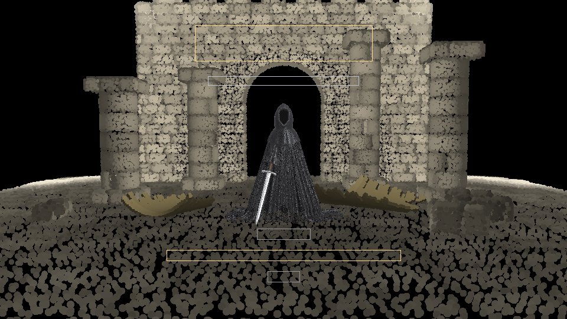

（タイトル画面の構図。枠は文字が入る場所：上がタイトル『残響の騎士』、下がメニュー。騎士のまわりの廃墟は、数秒ごとの波で一瞬だけ見える）

1. メニューの **Tools > Echo Knight > Build Game (Title + All Chapters)** を押す。
   - タイトル画面・序章・第一章のシーンが `Assets/EchoKnightScenes` に保存され、**Build Settings** にも登録される。
   - 少し時間がかかる（第一章が大きいため）。
2. 終わると **EchoTitle** シーンが開くので、そのまま Play。

| 場面 | 内容 |
|---|---|
| タイトル | **はじめから** / **つづきから**（セーブがあるときだけ。どの章かも出る） / **おわる**。W/S・↑↓・十字キー・左スティックで選び、Enter・Space・Aで決定。マウスでクリックしてもよい |
| 章のはじめ | 「序章　崩れた鐘楼」などの章タイトルが出る |
| ゴール | 章の終わりの文字のあと、暗転して**自動で次の章へ**。最後の章のあとはタイトルに戻り「第二章へ　つづく」と出る |
| 一時停止 | **Esc**（ゲームパッドは **Start**）。つづける / タイトルへもどる |

- **セーブ**は自動（PlayerPrefs）。章に入ったときと、**鐘の祠を鳴らしたとき**に保存される。「つづきから」は、最後に鳴らした祠の前から始まる（祠を鳴らしていなければ、その章のはじめから）。
- 章の順番とシーン名は `EchoGame.cs` の `Chapters` にまとまっている。新しい章を足すときは、ここと `EchoPrototypeSceneBuilder.cs` の `ChapterLayout` に1行ずつ足す。
- 「Create Prologue Stage」などの個別のメニューも今まで通り使える（その章だけを試すとき）。ただし、その場合ゴールに着いても次の章へ進むには Build Game が必要（画面に案内が出る）。

## 序章「崩れた鐘楼」

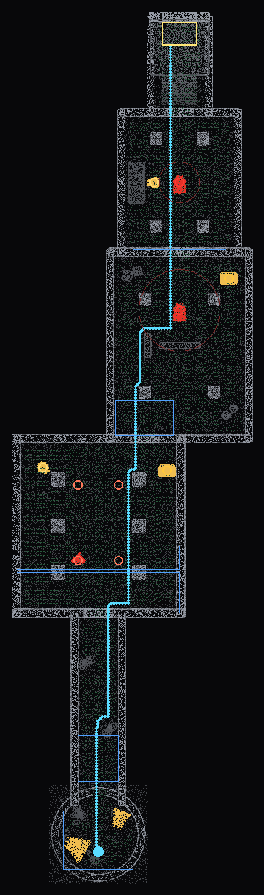

（真上から見た序章のマップ。青い線は、騎士がスタートからゴールまで歩けることを当たり判定で確かめた経路。赤は聴き手と徘徊範囲、橙は抜け殻の鎧の巡回路、黄は謎解きの鐘、金は祠・残響・鐘の破片、青い枠はヒントが出る場所、黄色い枠はゴール）

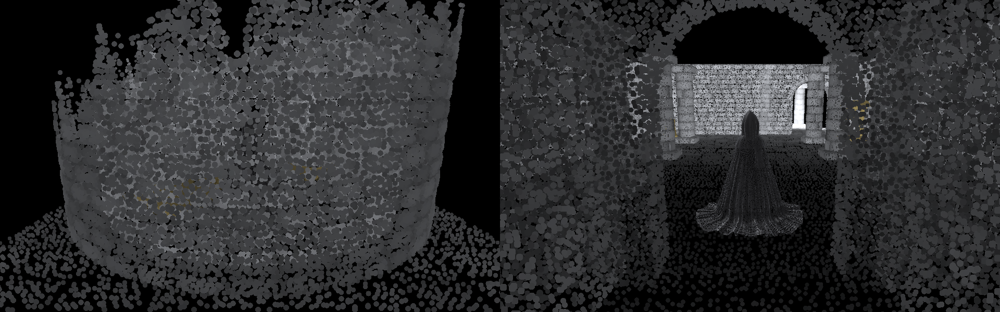

メニュー **Tools > Echo Knight > Create Prologue Stage** でシーンを作り、Ctrl+S で保存して Play。

| # | 場所 | 覚えること | 物語 |
|---|---|---|---|
| 1 | 崩れた鐘楼（上が崩れた円塔。暁鐘の破片が転がる） | 歩く | リーネ「……兄さん。聞こえる？」 |
| 2 | 細い回廊（瓦礫が道をふさぐ） | 走る | |
| 3 | 大広間（柱が並ぶ広い空間） | 鐘打ち・抜け殻の鎧をよける・空洞の壁（隠し部屋） | 鐘守りの残響、リーネ「……鎧が歩いてる」、隠し部屋に幼いリーネの残響 |
| 4 | 回廊の中庭（低い壁、祠） | 聴き手から隠れる | リーネ「……何かいる」 |
| 5 | 礼拝堂（祭壇、手前に祠） | 戦う・パリィ・歌う扉（鐘の順番） | 司祭の残響（物語の伏線） |
| 6 | 大門への階段 | ゴール | 「序章　崩れた鐘楼　―　完」 |

- **ヒント**（`EchoHintZone`）：その場所にいる間だけ、画面下に操作の説明やリーネの言葉が出る。
- **残響**（`EchoMemoryGhost`）：誰かの最後の瞬間が、ひざまずく金色の人影として残っている。近づくと小さく鳴って姿を見せ、最後の言葉が出る。
- **ゴール**（`EchoStageGoal`）：大門に着くと金色の大きな波が広がり、章の題名が出る。
- 新しい部品：崩れた塔（`Tower` の `ruined`。中に入れる）、瓦礫（`Rubble`）、暁鐘の破片（`BellFragment`、金色）。
- 配置は `EchoStages.cs` の `EchoPrologueLayout` にまとまっている。

## 第一章「灰の城下町」

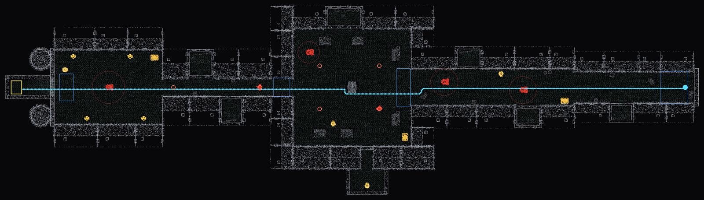

（真上から見た第一章。右がスタート、左がゴール。青い線は当たり判定で確かめた、スタートからゴールまで歩ける経路。下に飛び出しているのが隠し中庭）

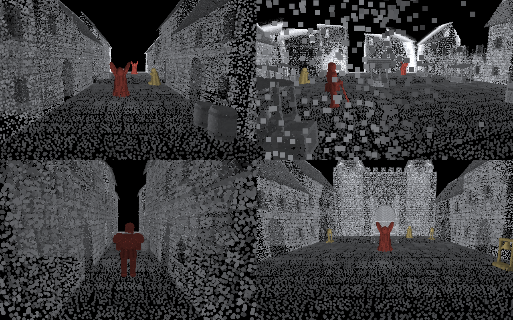

（左上：大通りと聴き手、右上：市場広場と抜け殻の鎧、左下：細い路地の鎧、右下：大聖堂の扉と4つの鐘）

メニュー **Tools > Echo Knight > Create Chapter 1 Stage** でシーンを作り、Ctrl+S で保存して Play。

| # | 場所 | 中身 | 物語 |
|---|---|---|---|
| A | 城門の通り | 崩れた城門から町へ。焼け落ちた家 | リーネ「……ここが、城下町。みんな、灰になってしまった。」 |
| B | 大通り | 聴き手2体。焼け落ちた家に入って隠れられる。祠 | 少年の残響「母さん、鐘が鳴らないよ。……夜が、終わらないよ」 |
| C | 市場広場 | 屋台と井戸。抜け殻の鎧が井戸のまわりを巡回、聴き手1体。祠。**西側の家の間に空洞の壁**（裏に隠し中庭） | 商人の残響（アルドレンが鐘楼へ走った夜の話）、隠し中庭に鐘守りの母の残響 |
| D | 細い路地 | 高い家にはさまれた一本道を、抜け殻の鎧が行ったり来たり。焼け落ちた家に逃げ込める | リーネ「……狭い。足音が、壁に跳ね返ってる。」 |
| E | 大聖堂の広場 | 聴き手1体が守る。**歌う扉と4つの鐘**（序章より長い4音）。祠 | 鐘守りの残響「割れた暁鐘の心臓は、大聖堂の下へ沈んだ……」 |
| F | 大聖堂の下 | 地下への階段。ゴール | 「第一章　灰の城下町　―　完」 |

- 道案内はない。音と波だけで進む（序章で覚えたことを全部使う）。
- 町の部品（`EchoKitTown.cs`）：
  - **家**（House）：窓、扉、石の帯、切妻の瓦屋根、煙突。並んだ家は裏側を作らない（Front Only）ので軽い。
  - **焼け落ちた家**（House + Ruined）：屋根がなく、壁の上がギザギザ。中に入れる（隠れ場所）。
  - **井戸**（Well）・**市場の屋台**（Stall）。
- 点の数は約126万。序章（約61万）の2倍なので、重い場合は家の `Point Spacing` を大きくする。

## 残響の騎士 プロトタイプ（暗闇＋音の波）

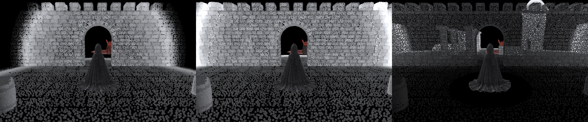

（左：歩いたときの波、中：鐘打ちの波が広がる瞬間、右：波が通り過ぎて手前から消えていくところ。赤いのは聴き手）

### 作り方
1. 全ファイルを入れてConsoleにエラーが無いことを確認
2. メニュー **Tools > Echo Knight > Create Prototype Stage** を押す（新しいシーンが自動で作られる）
3. **Ctrl+S** でシーンを保存して **Play**

### 操作
| 操作 | 内容 |
|---|---|
| WASD / 左スティック | 歩く（一歩ごとに小さな波） |
| 左Shift / 左スティック押し込み・右トリガー | 走る（大きな波。敵に聞かれやすい） |
| Space / ゲームパッドY | 鐘打ち（とても大きな波。8秒待つと再使用可） |
| 左クリック / ゲームパッドX | 弱攻撃（右上から左下への斬り。速い） |
| E / ゲームパッドRB | 強攻撃（振りかぶって振り下ろす。遅いが2.5倍のダメージ、とても大きな音） |
| Q / ゲームパッドLB | パリィ（敵の攻撃の直前に押すと弾く） |
| F / ゲームパッドA | 鐘の祠で鐘を鳴らす（セーブ） |
| 右ドラッグ / 右スティック | カメラを回す |
| ホイール | ズーム |

### 仕組み
- 世界（建物・床・敵）は **EchoKnight/WorldPoint** シェーダーで描かれ、普段は完全に見えない。音の波が通った点だけが一瞬光り、約1秒で消える（Inspectorの EchoSystem で調整）。
- 地形は白、敵は赤。敵が出した音の波は、照らしたものを赤く染める。
- 建物は数式の部品キット（`EchoKitPiece`）：Floor（敷石）、Wall（石積み、狭間つき可）、ArchWall（アーチの門）、Pillar（柱）、Tower（扉・矢狭間・円錐屋根の塔）、Stairs（階段）、Platform（台座）、Crate（木箱）、Barrel（樽）。Inspectorで大きさを変えると作り直され、当たり判定（BoxCollider）も自動で付く。
- 聴き手（`EchoListenerEnemy`）は目が見えず、音だけで追ってくる。遠い音は調べに来て、近い音や鐘打ちには走ってくる。音が4秒しなければ諦めて徘徊に戻る。立ち止まっていれば見つからない。捕まるとスタート地点に戻される（戦闘は次の段階で追加）。
- 足音の波は一歩ごとには出ない。歩くと約3秒に1回（半径11）、走ると約1.6秒に1回（半径22）。見えている時間は約1秒（EchoPlayer の Walk / Run Echo Interval・Radius、EchoSystem の Hold Time）。
- 聴き手の足音の波は、徘徊中は約3.5秒、調べに来るときは約2.2秒、追いかけるときは約1.1秒に1回。間隔は少しずつばらつく（EchoListenerEnemy の Wander / Investigate / Chase Echo Interval）。
- 音は壁を通り抜ける（壁の向こうの敵も波で見える）。

### 鐘の祠（セーブ地点、`EchoBellShrine`）

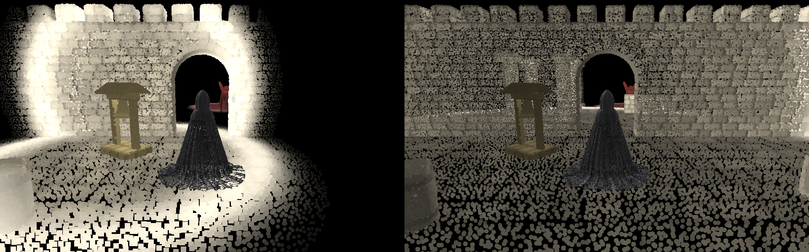

（鐘を鳴らした瞬間と、その少し後。世界が金色に照らされる）

- 小さな鐘つきの祠。波が当たると**金色**に見える。プロトタイプにはスタート近くと、台座の上の2か所にある。
- 近くで **F（ゲームパッドA）** を押すと鐘が揺れて鳴り、金色の大きな波が広がる。
  - 体力が全回復する。
  - 倒れたとき、この祠の前から再開する。
  - 鐘の音を聞いた聴き手は逃げていく（暁鐘の音がしじまを押し返していた、という設定から）。
- 祠のそばにいるときだけ、画面の下に操作の案内が出る。

### 音（`EchoAudio` / `EchoSoundSynth`）

- 効果音は**すべてプログラムで作っている**（音声ファイル不要）。起動時に一度だけ作られる。
- 3D音響で鳴るので、音の方向と距離がわかる（ヘッドホン推奨）。カメラの AudioListener に石の回廊の残響（Reverb）がかかる。
- 鳴る音：騎士の足音（毎歩。波は間隔をあけて出る）、走る足音、鐘打ち、剣の振り（弱・強）、斬撃が当たる音、パリィ、被弾、倒れる音、祠の鐘、聴き手の足を引きずる音・攻撃前の叫び・倒れる声・逃げる声、抜け殻の鎧の足音（金属のきしみ）・剣を振り上げる音・斬られた音・崩れる音、謎解きの鐘・扉の拒む音・扉が開く音・空洞の壁の響き・壁が崩れる音、暗闇の風（環境音）。
- 音量・残響の種類・聞こえる距離は、シーンの **EchoAudio** で調整できる。
- `Tools/Preview` で `dotnet run -c Release -- sounds 出力フォルダ` を実行すると、全部の音をWAVに書き出して聞ける。

### 戦闘（`EchoCombat`）

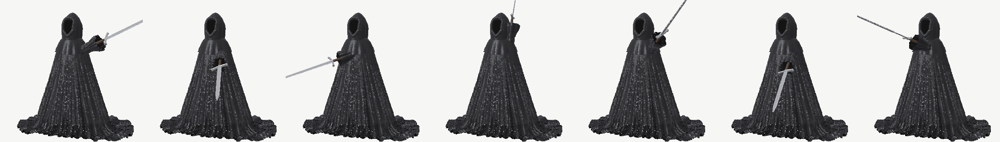

（左から：弱攻撃の振りかぶり・途中・終わり、強攻撃の振りかぶり・途中・振り下ろし、パリィ）

- 剣を振ると音が出る（弱攻撃は小さな波、強攻撃は大きな波）。戦うと周りが見えるが、敵にも聞こえる。
- 当たると敵の位置から赤い波が出て、何に当たったか見える。
- 聴き手は近づくと**叫び（赤い波）**を上げ、約0.75秒後に攻撃する。叫びを見てから**Q（パリィ）**を押すと弾き返し、鐘のような大きな波が出て、敵は1.8秒動けなくなる（その間はダメージ2倍）。
- 聴き手の体力は4（弱攻撃4回、強攻撃2回）。倒すと大きな波を出して消える。
- 騎士の体力は5。HPバーは無く、傷つくほど画面の端が暗くなり、攻撃を受けると赤く光る。体力が無くなるとスタート地点に戻る。
- 剣の振りは、腕（袖）と剣を肩を中心に回して表現している（`LoweredRight` の持ち方が前提）。
- エディター上ではステージが薄く表示される（EchoSystem の Show Stage In Edit Mode）。

### 抜け殻の鎧（`EchoHollowArmorEnemy`）

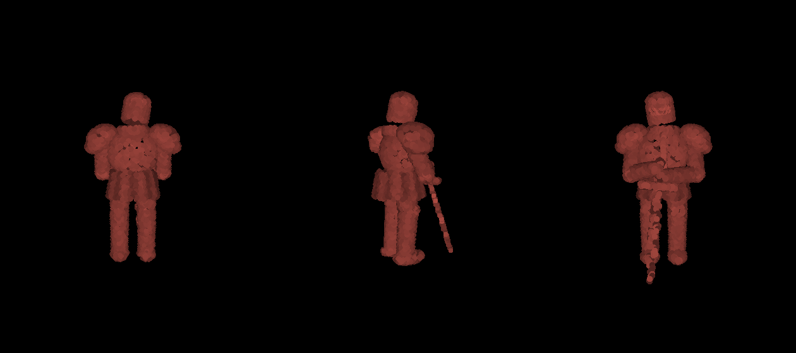

（左から：後ろ、斜め、前。中身のない鎧が大剣を下に向けて持っている）

- 中身のない鎧。**歩いても波を出さない**ので、騎士の波が当たったときにしか見えない。金属のきしむ足音はいつも聞こえるので、耳で位置がわかる。
- 決まった道（Route）を、ゆっくり行ったり来たりする。
- 耳は聞こえない。騎士が**前方5以内**か**背後2.5以内**に入ると気づく。走る足音や鐘打ちは、床の揺れとして近くなら感じ取る（歩く足音は感じない）。
- 追ってくる速さは騎士の歩きより少し遅い。5秒気配がなければ道に戻る。
- 攻撃は重い両手の一撃（ダメージ2）。**合図は「金属がこすれる音」だけで、赤い波は出ない**。音が鳴ってから約0.95秒後に振り下ろすので、そこでパリィ。振り下ろした剣が床を打つと赤い波が出る。
- 体力は6（弱攻撃6回、強攻撃3回）。斬られてもひるまない。
- 祠の鐘を聞くと、6秒間その場で止まる（かつて鐘守りだった名残）。

### 音の謎解き（`EchoBellDoor` / `EchoPuzzleBell` / `EchoHollowWall`）

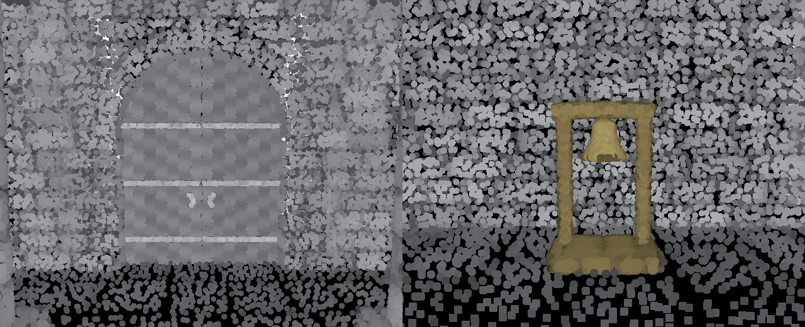

（左：歌う扉、右：謎解きの鐘）

**歌う扉（鐘の順番）**
- 閉じた両開きの扉。近づくと、まわりの鐘が**決まった順番で1つずつ鳴る**（扉が「歌う」）。音はそれぞれの鐘の場所から鳴るので、**どの方向から聞こえたか**で順番を覚える。鳴った鐘は小さく金色に光る。
- 同じ順番で鐘を鳴らすと扉が開く。鐘は**剣で打つ**か、近くで **F（ゲームパッドA）**。
- 違う鐘を鳴らすと扉が「ガチャン」と鳴って、最初からやり直し。扉から離れてまた近づくと、もう一度歌ってくれる。
- 鐘を鳴らすと大きな音が出るので、**聴き手が寄ってくる**。先に聴き手を倒すか、追い払ってから解くとよい。
- 鐘ごとに音の高さが違う（Note）。順番は扉の **Sequence** で変えられる。

**空洞の壁（隠し部屋）**
- 見た目はほかの壁と同じだが、裏に部屋がある。
- **鐘打ち（Space）や強攻撃**の大きな波が届くと、「ゴォン」と低く響いて金色に光る。足音の小さな波では反応しない。祠の鐘にも反応する。
- **強攻撃（E / RB）**で壊せる。弱攻撃ではノックするだけ。壊すと大きな音が出る（敵に聞こえる）。

- 謎解きの鐘・扉・壁の光る波（金色）には、敵は反応しない。

## 頂点データ（C# → HLSL）

| チャンネル | 内容 |
|---|---|
| `POSITION` | 位置 |
| `NORMAL` | 布の法線 |
| `TANGENT` | xyz = 布の流れ方向（シワ方向）、w = 層 (-1 裏 〜 +1 表) |
| `COLOR` | r = Part ID / 32、g = 大シワ (0 谷 〜 1 山)、b = Void量、a = 乱数 |
| `TEXCOORD0` | x = サイズ倍率、y = 風の影響度 |
| `TEXCOORD1` | x = 中シワ、y = 焼き込みAO |
| `TEXCOORD2` | x = 材質（0 布、1 鋼、2 革） |

## シェーダー

- `MeshTopology.Points` の各点を**ジオメトリシェーダー**でカメラ向きの小さなQuadに展開し、布の流れ方向に少し伸ばしている。
- Quad内の座標は通常の `TEXCOORD` で渡すので、**`SV_PointCoord` は使っていない**（ps_4_0での `invalid ps_4_0 input semantic 'SV_PointCoord'` を回避）。
- `#pragma target 4.0` / `#pragma require geometry`。D3D11・Vulkan・OpenGL Coreで動作する想定。**MetalやWebGLはジオメトリシェーダー非対応**なので動かない（必要になったらC#側でQuad展開する方式を追加する）。
- 円形にクリップした不透明Particle（ZWrite On）にしているので、煙や霧のように透けない。
- ライティング: Fake Light（任意でURPのMain Lightとブレンド）、Wrap Diffuse、シワ方向に長いサテン調の異方性スペキュラー（Ward系）、山へのハイライト、谷の暗さ、Rim Light、布の裏側の暗さ、フード内のVoid。
- 風: 頂点シェーダーで、ゆっくりしたうねり＋突風＋小さな揺れ。肩やフードはほぼ固定、裾ほど動き、地面の布はあまり動かない。

## Inspectorの主なパラメータ

- **Particles**: Point Size, Point Variation, Flow Stretch
- **Wind**: Strength, Speed, Frequency, Direction, Flutter
- **Cloth Look**: Base / Sheen / Ambient色、Fake Light方向、スペキュラー、異方性、山のハイライト、谷の暗さ、Rim、Void色、布の裏側の明るさ、Debug Part Colors
- **Shape**: Height, Hood Width/Height/Depth、開口部サイズ、Crown Softness、Shoulder Width/Drop、Cloak Width / Hem Width / Depth、Hem Bend Height、Front Gap、Fold Count / Amplitude / Irregularity / Drift、Secondary Folds、Micro Noise、前垂れのシワ、Ground Spread / Train / Wrinkles / Bundles、厚み
- **Density**: 全体のMultiplier ＋ 群ごとのParticle数（既定で合計約11.5万）

## 確認状況と注意

- C#の形状生成部分は、Unityの型を置き換えるスタブを使って .NET 8 でビルド・実行し、`Tools/Preview` で描画して形状を確認済み（上の画像）。
- **Unity上（C# MonoBehaviour部分とHLSL）はこの環境ではコンパイル確認できていない。** URPのShaderLibrary関数（`TransformWorldToViewDir`, `GetWorldSpaceViewDir`, `GetMainLight` など）はURP 10以降を想定。
- 生成は約1秒（Release .NET）。Unity Editor（Mono）ではもう少しかかる。`Auto Regenerate` がONだと値を変えるたびに再生成されるので、重い時はOFFにして **Regenerate** を手動で実行する。
- プレビューは点サイズ0.02。Unityでは `Point Size` 0.012〜0.02付近で、密度Multiplierと合わせて調整する。

## オフラインプレビュー（任意）

```bash
cd Tools/Preview
dotnet run -c Release -- cloak.bin 10 1337 0   # Build Stage (1-10)、seed、剣の持ち方 (0-2、-1で剣なし)
python3 render_preview.py cloak.bin out.png  # --debug でPart色分け、--views 0,1.57 で視点指定
```

## 次の作業候補

- Unity上でシェーダーのコンパイルと見た目を確認し、Point Size・スペキュラーを調整
- 中央前垂れをもう少し目立たせる（オフセットとシワの深さ）
- 移動に合わせた形状変化（後ろへなびく）用のデータをC#から渡す
- Metal対応が必要ならC#でQuad展開するレンダリングモードを追加
